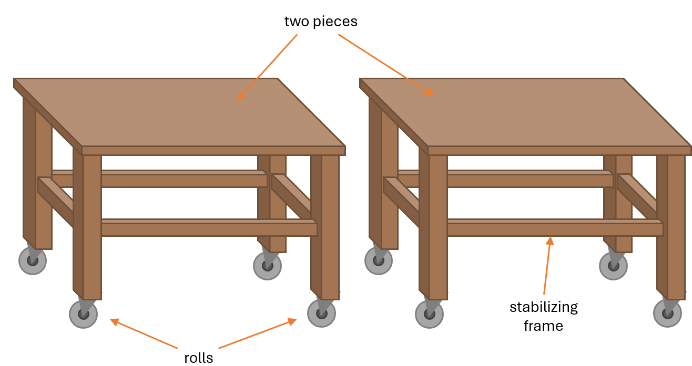
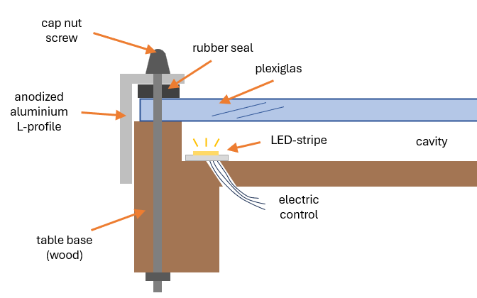

# Explanations and Details:

## Introduction

During covid, lockdowns led to the restriction of many outdoor activities. However, in Germany the maximal number of people to meet outdoors was bounded by 2, sometimes even by 4, depending on the severity of the pandemic.

Due to this constraint, activities with friends were limited. This encouraged me to fulfill a project of mine that I was thinking about for some time.

The idea of this project was to create a beerpong table that incorporates electronics in order to automatically visualize the score. I wanted to somehow get to the information of how many cups are still standing on the table and then use LEDs to show the score or some kind of feedback. 

A friend of mine and me constructed the mechanical assembly of the table. Afterwards, I developed and built the electrical part of the table. \
However, keep in mind that the mechanical construction is dependent on the electrical system which is why both parts go hand in hand in the idea creation.

## Mechanical built

### Base:

For the mechanical part I wanted to be cost efficient. Nontheless, I wanted to create a steady built that can withstand heavy usage even if a drink is spilled or if it might be raining when the table is used outside. \
Hence, I took solid wood as the material for the base of the table. 

Since creating the table in one piece would lead to a huge and bulky table, I split the assembly into two sides. This leads to the advantage of stacking the two tables on top of each other when it is not in use.

To create a steady table a stabilizing frame is added to the mechanic assembly. This is crucial as otherwise there is a risk of collapse if weight is applied. Further, I added rolls for better handling since solid wood is heavy to carry.

  

      
Base assembly of the two tables:

      
  

To seal the wood from any kind of fluids, the complete base got painted using waterproof wood varnish.

### Connecting components:

Since I wanted to add LED-stripes to the table, I thought about different options how to incorporate electronics while still remaining steady and resilient. Using epoxy to seal the stripes would lead to a unique look, but also to an irreversible built which would be suboptimal when electronics get damaged. \
I chose to create a cavity using plexiglas, where the LED-stripes can be placed. The plexiglas would function as the table top creating a small cavity with the wood base of the table.

  

      
Side profile of the table displaying the cavity for LEDs:

      
  

The image visualizes the connection of the components. Glueing plexiglas and wood using two-component glue would solve the issue, but would also lead to an irreversible assembly. It is better to use screws in order to reverse the assembly when electronics get damaged or cleaning is necessary. \
The problem with using screws is proper sealing which is why I used rubber seal to protect the cavity from outer influences.

For aesthetics, I used an aluminium L-profile to keep the connection safe from the side which led to an industrial look of the table. Further, cap nuts are utilized to enhance the look of the table top. Using cap nuts is advantageous because it mitigates the risk of cutting injury.

An issue, that might come up to your mind is that, outer pressure on the table top would lead to cracks in the plexiglas. \
While this assumption is true for high pressures, such as a person standing on the table, fastening the plexiglas using nut screws, seemed to increase the tension in the plexiglas, solving this issue. 

After this mechanical assembly the electrical built can be developed and added to the table.

## Electrical built

...

## Problems and possible Improvements

...

## Costs

Since I am creating this repository more than 3 years after the completion of the built, the computation of the full costs is difficult. However, here I am trying to reestimate the costs of the project:

Category      | Items                    | Price (€) |
:------------ | :----------------------- | :-------: |
Mechanic      | Wood                     | xx.xx     |
&nbsp;        | L-profiles (aluminium)   | xx.xx     |
&nbsp;        | Nuts and screws          | xx.xx     |
&nbsp;        | Other assembly metals    | xx.xx     |
&nbsp;        | Plexiglas                | xx.xx     |
&nbsp;        | Wood varnish             | xx.xx     |
&nbsp;        | Rolls                    | xx.xx     |
Electric      | Arduino Mega (x2)        | xx.xx     |
&nbsp;        | xxx                      | xx.xx     |